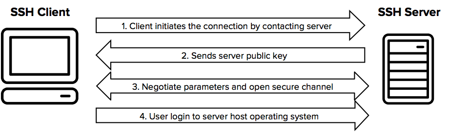

## 쉘 ([Shell](../os/Shell.md))

쉘이란 사용자의 명령을 커널(Kernel)에 전달하고, 그 처리 결과를 다시 사용자에게 알려주는 **프로그램**(= 사용자와 운영체제간의 인터페이스 역할을 하는 소프트웨어)을 뜻한다. 쉘은 커널을 마치 껍질처럼 감싸고 있어, 사용자는 이 껍질을 통해야만 커널과 통신할 수 있다 하여 이런 이름이 붙었다.

## SSH(Secure Shell)

SSH는 **네트워크 상 다른 컴퓨터의 쉘을 사용할 수 있게 해 주는 프로그램 혹은 그 프로토콜**을 의미한다. SSH를 사용하면 원격에서 네트워크 상의 컴퓨터에 접속할 수 있다. 기존의 유닉스 시스템 셸에 원격 접속하기 위해 사용하던 텔넷은 암호화가 이루어지지 않아 계정 정보가 탈취될 위험이 높으므로, 여기에 암호화 기능을 추가하여 1995년에 나온 프로토콜이다. 기본 포트는 22번이다. 셸로 원격 접속을 하는 것이므로 기본적으로 CLI 상에서 작업을 하게 된다. SSH는 강력한 보안을 제공하기에 안전하지 못한, 개방된 네트워크에서도 안전하게 통신할 수 있다.

SSH가 동작하는 순서는 이렇다. SSH 서버(SSH Server)라 불리는 데본(daemon)이 항상 돌면서 원격지의 SSH 클라이언트(SSH Client)로부터의 접속을 기다리고 있다가, SSH 클라이언트가 접속을 시도하면 다음 순서로 SSH 서버와 클라이언트 간 보안 연결이 수립된다.

### SSH 프로토콜 작동 방식

1. **클라이언트가 연결을 시작**:
    - SSH 클라이언트가 서버에 연결을 시도한다. 클라이언트는 서버의 IP 주소와 포트 번호(통상적으로 22번)를 사용해 네트워크를 통해 연결 요청을 한다.

2. **서버의 공개키를 클라이언트에게 전송**:
    - SSH 서버가 자신의 공개키를 클라이언트에게 전송한다. 클라이언트는 이 공개키를 이용해 나중에 서버로부터 받은 데이터를 인증하고 암호화된 세션을 설정할 수 있다.
    - 클라이언트는 받은 공개키를 이미 알고 있는 서버의 공개키와 비교함으로써 서버의 정체성을 검증한다. 이 과정을 호스트 키 검증이라고 부른다.

3. **파라미터 협상 및 보안 채널 개설**:
    - 클라이언트와 서버가 암호화된 통신을 위한 파라미터들을 협상한다. 이 파라미터들에는 암호화 알고리즘, 키 교환 방법 등이 포함된다.
    - 키 교환 과정을 통해 생성된 공유 비밀키는 세션의 나머지 부분에 대한 암호화에 사용된다. 이 과정을 통해 데이터의 기밀성과 무결성이 보장된다.

4. **사용자가 서버의 운영 체제에 로그인**:    
    - 파라미터 협상이 완료되고 암호화된 채널이 설정되면 사용자는 서버에 로그인을 시도한다. 이때 사용자는 비밀번호를 입력하거나 공개키/개인키 쌍을 이용한 인증 방식을 사용할 수 있다.
    - 공개키 인증을 사용하는 경우, 서버는 사용자의 공개키로 암호화된 챌린지를 클라이언트에게 보내고, 클라이언트는 개인키를 이용하여 이를 복호화한 후 서버로 응답을 보낸다. 서버는 이 응답을 검증하여 사용자의 정체성을 확인한다.
    - 인증이 성공적으로 완료되면, 사용자는 서버 상의 쉘에 접근할 수 있으며, 명령어 입력 등의 작업을 수행할 수 있다.연결 이전, 서버와 클라이언트는 서로의 공개 키(Public Key)를 알고 있다.
    
### 공개키 인증을 사용하는 경우
1. 서버 인증 : 클라이언트는 난수를 하나 생성한 후, 이를 서버의 공개 키로 암호화해서 서버에게 전송하고, 난수의 해시(Hash)를 저장해 둔다. 서버는 전송받은 암호화된 난수를 서버 자신의 개인 키(Private Key)로 복호화한 후, 복호화된 난수의 해시를 계산해 클라이언트에게 전송한다. 클라이언트는 전송받은 난수의 해시를 저장된 해시와 비교하여 서버를 인증한다.
2. 클라이언트 인증 : 위 서버 인증 과정에서 서로의 역할만 바꿔 동일하게 진행한다. 즉, 서버는 난수를 하나 생성한 후, 이를 클라이언트의 공개 키로 암호화해서 클라이언트에 전송하고, 난수의 해시를 저장해 둔다. 클라이언트는 정송받은 암호화된 난수를 클라이언트 자신의 개인 키로 복호화한 후, 복호화된 난수의 해시를 계산해 서버에게 전송한다. 서버는 전송받은 난수의 해시를 저장된 해시와 비교하여 클라이언트를 인증한다.
3. 양 측간의 인증이 끝나면, 비대칭 키를 이용하여 대칭 키(Session Key)를 교환한다.

- **공개키로는 암호화 / 개인키로는 복호화** -> 복호화에 사용되는 개인키는 어디 보내지 않는다.
- 공개키 암호화 방식은 주로 [[RSA 암호화]]를 사용한다. 

---
### references
https://www.ssh.com/academy/ssh
https://www.ssh.com/academy/ssh/protocol
https://medium.com/@jamessoun93/ssh%EB%9E%80-%EB%AC%B4%EC%97%87%EC%9D%B8%EA%B0%80%EC%9A%94-87b58c521d6f