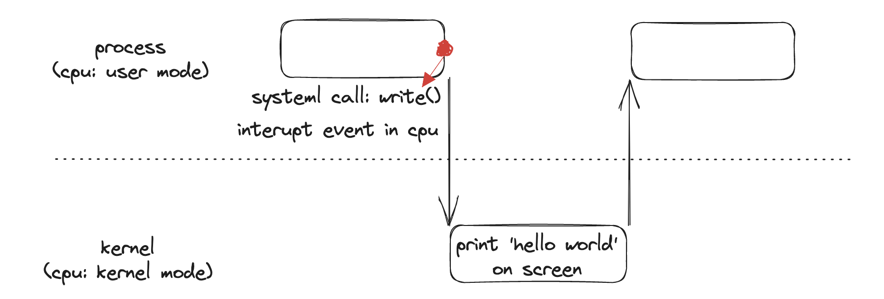

# CHAPTER2. 사용자 모드로 구현되는 기능

### 시스템 콜

커널의 도움이 필요한 경우 프로세스는 시스템 콜을 통해 커널에 처리 요청을 한다.
커널 모드에서 실행해야하는 경우(=시스템 콜의 종류)

- 프로세스 생성, 삭제
- 메모리 확보, 해제
- 프로세스 간 통신(IPC)
- 네트워크
- 파일시스템 다루기
- 파일다루기(디바이스 접근)

**예제**

- 단순한 메시지를 출력하는 코드 hello 프로그램

```c
#include <stdio.h>

int main(void)
{
	puts("hello world");
	return 0
}
```

- 시스템 콜 호출과 CPU 모드 변경
  

프로세스는 보통 사용자 모드로 실행되고 있다. 시스템 콜을 호출하면 CPU에서 인터럽트 이벤트가 발생한다. 인터럽트 이벤트가 발생하면 CPU는 사용자 모드에서 커널 모드로 변경 되어 프로그램을 처리하고 완료 후 사용자 모드로 돌아간다. (물론 실제로 프로그램에 strace를 적용해보면 시스템 콜이 1회가 아닌 31회 호출되는 것을 볼 수 있다. 프로그램 시작과 종료 처리를 위한 시스템 콜이 호출되었기 때문이다.)

**실험**

1. 어떤 시스템 콜을 호출했는가 : `strace`

```shell
$ strace -o hello.log .hello # hello.log 파일에 .hello 의 시스템 콜 호출 기록을 출력
```

2. 프로세스가 사용자 모드와 커널 모드 중 어느쪽에서 실행되고 있는지: `sar`

```shell
$ sar -P ALL 1 2 # 1초 단위로 2번 확인

Linux 5.15.0-1036-aws (ip-172-31-11-86)         08/28/23        _x86_64_        (1 CPU)

12:22:42        CPU     %user     %nice   %system   %iowait    %steal     %idle
12:22:43        all      2.00      0.00      0.00      0.00      0.00    98.00
12:22:43          0      2.00      0.00      0.00      0.00      0.00    98.00

12:22:43        CPU     %user     %nice   %system   %iowait    %steal     %idle
12:22:44        all      2.00      0.00      0.00      0.00      0.00    98.00
12:22:44          0      2.00      0.00      0.00      0.00      0.00    98.00

Average:        CPU     %user     %nice   %system   %iowait    %steal     %idle
Average:        all      2.00      0.00      0.00      0.00      0.00    98.00
Average:          0      2.00      0.00      0.00      0.00      0.00    98.00
...

```

사용자 모드 : %user + %nice
커널 모드(시스템 콜 등 처리) : %system

3. 시스템 콜 소요시간 : `strace -T`

```shell
$ strace -T -o hello.log .hello # hello.log 파일에 .hello 의 시스템 콜 호출 기록과 소요 시간을 출력해라
```

### OS가 제공하는 라이브러리

리눅스에는 프로그램의 작성을 도와주기 위해 여러 라이브러리 함수가 있다. 시스템 콜은 보통 함수 호출과는 다르게 C 언어 등 고급언어에서는 직접 호출이 불가능(=?? 바로 컴파일 못한다? 어차피 호출하면 컴파일해서 어셈블리 언어보 바꾸잖아?)하다. _아키텍처에 의존하는_ 어셈블리 코드를 사용해야한다.

이 방식을 간단하게 하기 위해 OS에서는 내부적으로 시스템 콜을 호출하는 일만 하는 wrapper 함수를 제공한다. wrapper 함수는 아키텍처별로 존재한다.

리눅스는 glibc를 표준 C라이브러리로 사용하고 있다. 대부분의 C프로그램은 glibc를 링크하고 있으며 glibc는 시스템 콜의 wrapper 함수를 포함한다.

### OS가 제공하는 프로그램

- 시스템 초기화: init
- OS의 동작을 바꿈 : sysctl, nice, sync
- 파일 관련 :touch, mkdir
- 텍스트 데이터 가공: grep, sort, uniq
- 성능 측정 : sar, iostat
- 컴파일러 : gcc
- 스크립트 언어 실행 환경 : perl, python, ruby
- 셸 : bash
- 윈도우 시스템 : X
